# SmokeHouse – Responsive Product Landing Page

## Introduction

### What is a Product Landing Page?

A product landing page is a web page designed to introduce and promote a product, service, or business. It presents important information in one organized page, such as the business name, features, products, pricing, customer feedback, and contact information.

### Why are Landing Pages Important for Businesses?

Landing pages are important because they help businesses create a strong first impression online. They allow customers to quickly understand what the business offers and make important actions easier to find.

A good landing page can help a business:

- Present its products and services clearly.
- Improve its online presence.
- Attract potential customers.
- Make information easier to access.
- Encourage visitors to contact or purchase from the business.
- Provide a better experience on both desktop and mobile devices.

### Purpose of the Project

The purpose of this project is to create a modern and responsive landing page for **SmokeHouse**, a local grilled-food business located in **Barangay Central, Quezon City**.

SmokeHouse offers dine-in and takeout grilled dishes such as chicken inasal, grilled pork, liempo, platters, and family meals.

The project transforms the existing business information and branding into a cleaner and more professional website using **Laravel, Blade Components, and Tailwind CSS**.

---

# Objectives

The objectives of this project are to:

1. Develop a responsive landing page using Laravel.
2. Apply Tailwind CSS for modern interface styling.
3. Create reusable Blade Components.
4. Reduce duplicated HTML code through component-based development.
5. Apply responsive layouts using Flexbox and CSS Grid.
6. Design layouts for desktop, laptop, tablet, and mobile devices.
7. Maintain consistent colors, typography, spacing, buttons, and cards.
8. Improve the online presentation of an existing local business.
9. Practice proper Laravel frontend project organization.
10. Build a project that can be included in a professional portfolio.

---

# Business Information

**Business Name:** SmokeHouse  
**Location:** Barangay Central, Quezon City  
**Business Type:** Restaurant / Grilled Food Business  
**Service Options:** Dine-In and Takeout  

SmokeHouse offers Filipino grilled dishes including:

- Chicken Inasal
- Grilled Pork Chop
- Grilled Liempo
- Grilled Platters
- Solo Meals
- Family Meals

The design of the website uses the existing SmokeHouse identity while presenting it through a modern and responsive interface.

---

# Website Sections

The landing page contains the following required sections:

## Navigation Bar

The navigation bar contains:

- SmokeHouse Logo
- Home
- Features
- Pricing
- Testimonials
- Contact
- Sign In
- Get Started

It also contains a responsive mobile navigation menu.

---

## Hero Section

The hero section introduces SmokeHouse to visitors.

It contains:

- Business/Product Name
- Catchy Headline
- Short Product Description
- Primary Call-to-Action
- Secondary Button
- Product/Food Image

### Main Headline

> **Smoked. Grilled. Made to Satisfy.**

The section also highlights SmokeHouse's:

- Dine-In service
- Takeout service
- Family Meals

---

## Features Section

The Features section presents six important features of SmokeHouse:

1. Flame-Grilled
2. Filipino Favorites
3. Complete Meals
4. Takeout Ready
5. Family Bundles
6. Budget Friendly

Each feature contains:

- Icon
- Feature Title
- Short Description

The individual cards are created using a reusable Blade Component.

Example:

```blade
<x-features.feature-card
    icon="✦"
    title="Flame-Grilled"
    description="Cooked over high heat for smoky flavor, juicy meat, and beautifully charred edges."
/>
```

---

## Product Showcase

The Product Showcase presents SmokeHouse products and demonstrates different interface views.

It includes:

- Product/Menu Screenshot
- Dashboard Preview
- Mobile View
- Key Highlights

The showcase presents popular SmokeHouse food choices and demonstrates how restaurant information can be displayed through a modern web interface.

---

## Pricing Section

The Pricing section contains three meal options:

### Solo Meal

Starting at **₱99**

### Smoked Platter

Starting at **₱149**

### Family Meal

Starting at **₱468**

Each pricing card contains:

- Plan Name
- Price
- Description
- Included Features
- Call-to-Action Button

The pricing cards use a reusable Blade Component.

Example:

```blade
<x-pricing.pricing-card
    plan="Solo Meal"
    price="₱99"
    description="A simple and satisfying option for one."
    :features="[
        'Grilled Pork Chop starting at ₱99',
        'Regular Chicken Inasal at ₱115',
        'Petcho Chicken Inasal at ₱135',
        'Grilled Liempo at ₱135',
    ]"
/>
```

---

## Testimonials

The testimonial section contains three customer-style testimonials.

Each testimonial card contains:

- Customer Photo
- Customer Name
- Customer Type/Position
- Review

The testimonials currently used in the project are hardcoded sample content for academic demonstration and are not presented as verified customer reviews.

---

## Call-to-Action

The Call-to-Action section encourages visitors to explore SmokeHouse's meals or contact the business.

The section uses reusable buttons to maintain consistent styling.

---

## Footer

The footer contains:

- SmokeHouse Business Information
- Quick Links
- Social Media Links
- Contact Information
- Copyright Information

---

# Responsive Web Design

Responsive Web Design allows a website to automatically adjust its layout depending on the screen size of the device being used.

The SmokeHouse landing page is designed for:

- Desktop
- Laptop
- Tablet
- Mobile Phone

## Mobile-First Design

The website uses responsive Tailwind CSS utilities to make layouts work properly on smaller devices before expanding them for larger screens.

For example:

```html
class="grid gap-5 sm:grid-cols-2 lg:grid-cols-3"
```

On smaller screens, the cards are displayed in one column.

At the `sm` breakpoint, the layout changes to two columns.

At the `lg` breakpoint, the layout changes to three columns.

---

## Responsive Breakpoints

The main Tailwind responsive breakpoints used in the project include:

- `sm:` – Small devices
- `md:` – Medium devices / Tablets
- `lg:` – Large devices / Laptops and Desktops

Example:

```html
class="grid gap-6 md:grid-cols-2 lg:grid-cols-3"
```

---

## Flexbox

Flexbox is used throughout the project to align elements.

Examples include:

- Navigation Bar
- Buttons
- Hero Section
- Customer Information
- Footer
- Mobile Navigation

Example:

```html
class="flex items-center justify-between"
```

---

## CSS Grid

CSS Grid is used for major responsive sections including:

- Features
- Product Showcase
- Pricing
- Testimonials
- Footer

Example:

```html
class="grid gap-6 md:grid-cols-2 lg:grid-cols-3"
```

---

## User Experience

Responsive design improves the user experience because users can easily access the website from different devices.

The design makes sure that:

- Text remains readable.
- Buttons remain accessible.
- Images scale properly.
- Cards reorganize depending on screen size.
- Navigation works properly on mobile.
- Content does not overflow the screen.

---

# Tailwind CSS

## What is Tailwind CSS?

Tailwind CSS is a utility-first CSS framework that allows developers to style interfaces using predefined utility classes.

Instead of writing large custom CSS files, styles can be applied directly inside HTML or Blade elements.

Example:

```html
<div class="rounded-2xl border border-white/10 bg-[#111111] p-7">
    Content
</div>
```

---

## Advantages of Tailwind CSS

Tailwind CSS provides several advantages:

- Faster frontend development
- Easy responsive design
- Consistent spacing
- Reusable styling
- Built-in hover effects
- Built-in responsive breakpoints
- Less custom CSS
- Easier interface maintenance

---

## Responsive Utility Classes

The project uses Tailwind responsive classes such as:

```html
sm:grid-cols-2
md:grid-cols-2
lg:grid-cols-3
```

These allow layouts to change automatically based on screen size.

---

## Component Styling

Tailwind CSS is also used to create consistent component styles.

Some common classes used in the project include:

```text
rounded-2xl
border-white/10
bg-[#111111]
text-zinc-500
px-6
py-24
max-w-7xl
transition
hover:border-white/20
```

---

# Blade Components

## What are Blade Components?

Blade Components are reusable interface elements in Laravel.

Instead of repeatedly writing the same HTML structure, the repeated interface can be stored inside a component and reused throughout the application.

For example:

```blade
<x-features.feature-card
    icon="✦"
    title="Flame-Grilled"
    description="Cooked over high heat for smoky flavor, juicy meat, and beautifully charred edges."
/>
```

---

## Why Blade Components Improve Maintainability

Blade Components help improve maintainability because they:

- Reduce duplicate HTML.
- Make code easier to organize.
- Maintain consistent interface styling.
- Allow one component to be reused with different data.
- Make future design changes easier.
- Improve code readability.

---

## Blade Components Used

The project uses the following component structure:

```text
resources/views/components/
│
├── features/
│   ├── feature-card.blade.php
│   └── features.blade.php
│
├── pricing/
│   ├── pricing-card.blade.php
│   └── pricing.blade.php
│
├── testimonials/
│   ├── testimonial-card.blade.php
│   └── testimonials.blade.php
│
├── navbar.blade.php
├── hero.blade.php
├── showcase.blade.php
├── button.blade.php
├── cta.blade.php
└── footer.blade.php
```

---

## Benefits of Modular UI Development

Using modular components makes the website easier to maintain.

For example, if the design of all pricing cards needs to change, only:

```text
pricing-card.blade.php
```

needs to be edited.

All pricing cards that use that component will automatically use the updated design.

---

# User Interface Design

## Color Palette

The SmokeHouse landing page uses a limited color palette based on the restaurant theme.

| Purpose | Color |
| --- | --- |
| Main Background | `#080808` |
| Secondary Background | `#0C0C0C` |
| Card Background | `#111111` |
| Primary Orange | `#F4510B` |
| Warm White | `#F7F3ED` |
| Muted Text | Zinc / Gray |

The design avoids excessive gradients and bright colors.

Orange is mainly used for:

- Important text
- Buttons
- Prices
- Section labels
- Small accents

---

## Typography

The interface uses bold headings to create a strong SmokeHouse identity.

Headings use:

- Bold or Black font weight
- Uppercase letters
- Tight letter spacing

Body text uses:

- Smaller font sizes
- Comfortable line height
- Muted gray color

This creates a clear visual hierarchy.

---

## Iconography

The feature cards use simple single-color symbols instead of colorful icons.

This keeps the design consistent with the SmokeHouse theme and avoids unnecessary visual distractions.

---

## Button Styles

Buttons use:

- Rounded shapes
- Orange primary color
- Dark secondary colors
- Consistent padding
- Simple hover effects

A reusable `button.blade.php` component is used to maintain consistent button styling.

---

## Card Design

Cards use:

- Dark solid backgrounds
- Thin borders
- Rounded corners
- Consistent padding
- Minimal hover effects

This supports the modern dark SmokeHouse design.

---

## Layout Consistency

Major sections use consistent width and spacing utilities such as:

```html
max-w-7xl
px-6
lg:px-8
py-24
```

Using the same spacing system helps maintain alignment throughout the website.

---

# Folder Structure

```text
week05-product-landing-page/
│
├── app/
│
├── public/
│   └── images/
│       ├── logo.jpg
│       ├── hero-smokehouse.jpg
│       ├── menu-smokehouse.jpg
│       └── testimonials/
│
├── resources/
│   ├── css/
│   │   └── app.css
│   │
│   ├── js/
│   │   └── app.js
│   │
│   └── views/
│       ├── layouts/
│       │   └── app.blade.php
│       │
│       ├── components/
│       │   ├── features/
│       │   ├── pricing/
│       │   ├── testimonials/
│       │   ├── navbar.blade.php
│       │   ├── hero.blade.php
│       │   ├── showcase.blade.php
│       │   ├── button.blade.php
│       │   ├── cta.blade.php
│       │   └── footer.blade.php
│       │
│       └── pages/
│           └── home.blade.php
│
├── routes/
│   └── web.php
│
├── screenshots/
├── documentation/
└── README.md
```

---

## Folder Purposes

### `resources/views/layouts`

Contains the main Laravel layout of the website.

### `resources/views/components`

Contains reusable Blade Components used throughout the landing page.

### `resources/views/pages`

Contains complete page views such as `home.blade.php`.

### `public`

Contains publicly accessible assets such as images and logos.

### `screenshots`

Contains screenshots used for project documentation.

### `documentation`

Contains supporting documentation including the before-and-after design comparison.

---

# Screenshots

## Desktop View

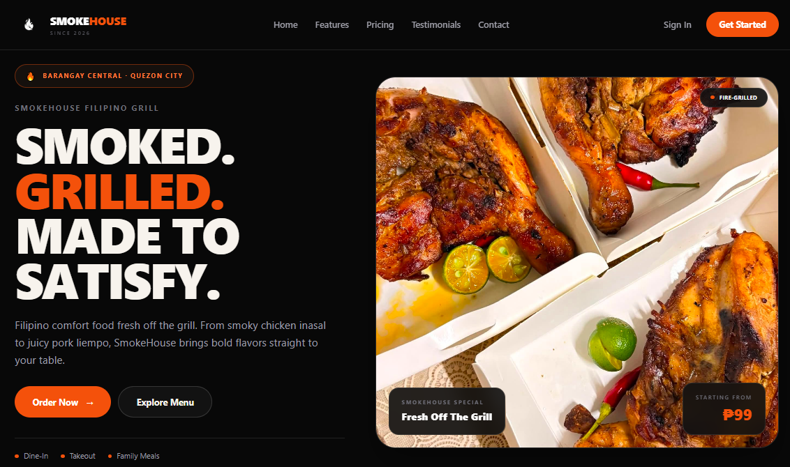

## Tablet View

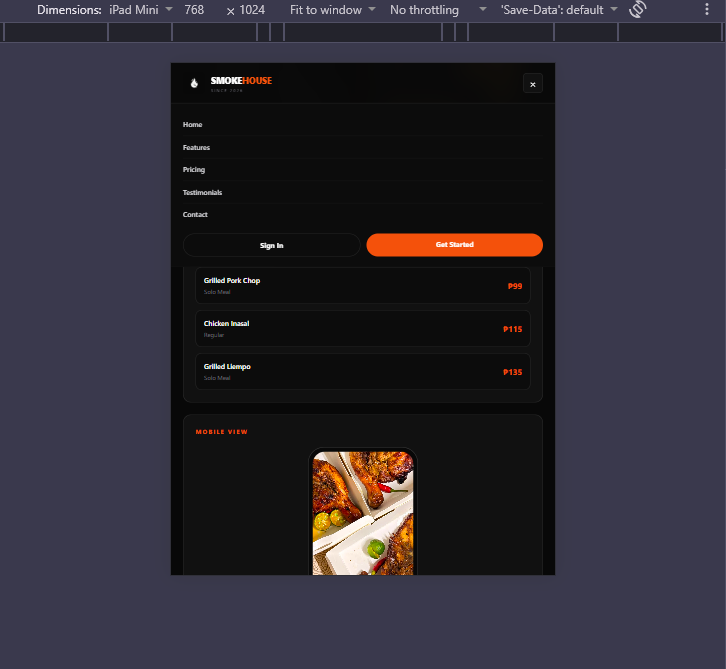

## Mobile View

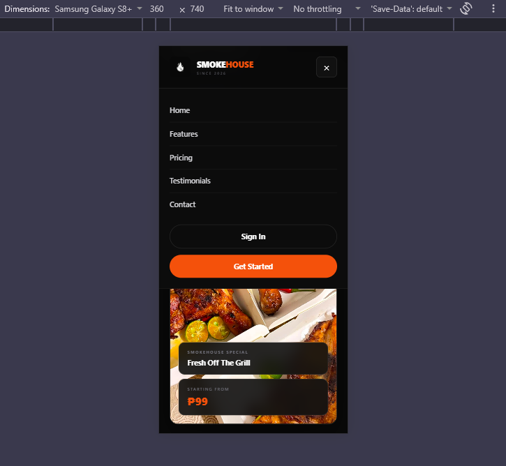

## Navigation Bar

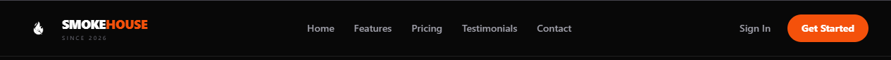

## Hero Section

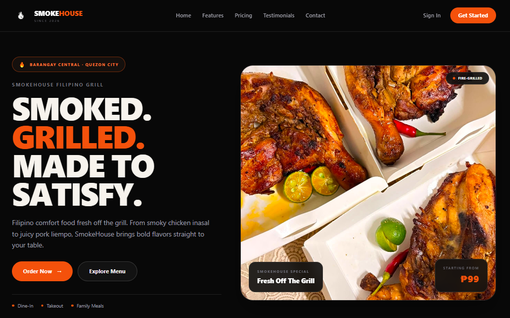

## Features Section

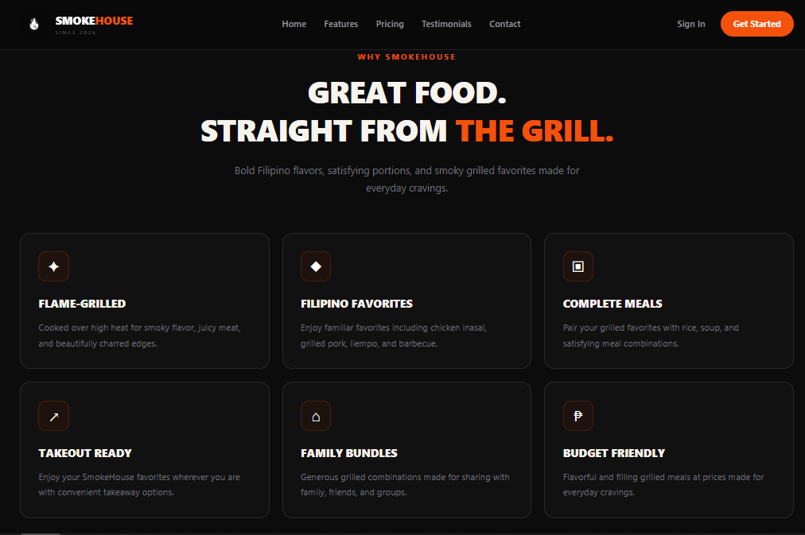

## Pricing Section

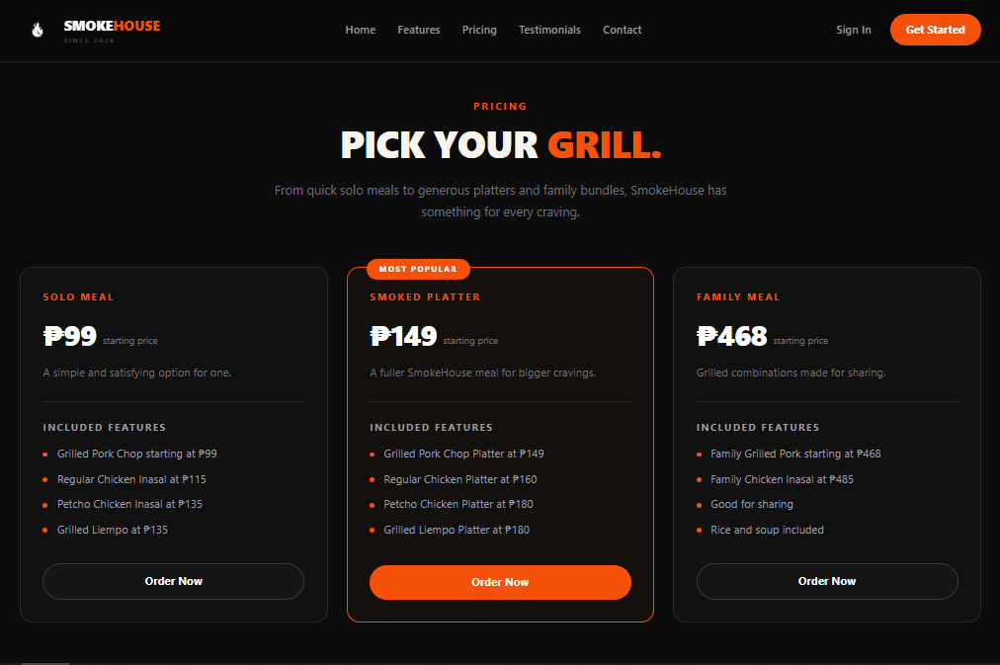

## Testimonials

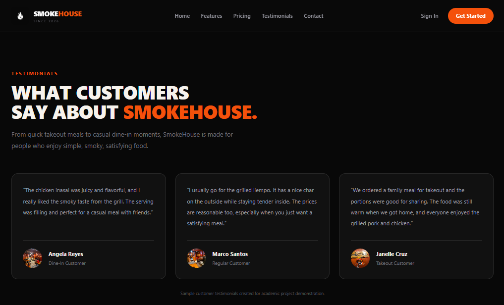

## Footer

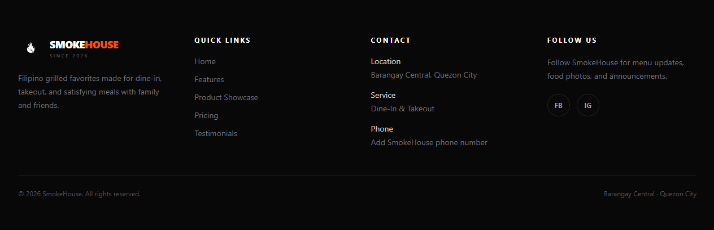

## Blade Components Folder

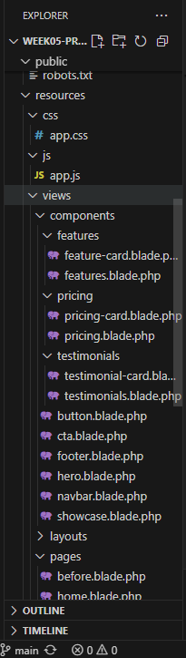

## GitHub Repository

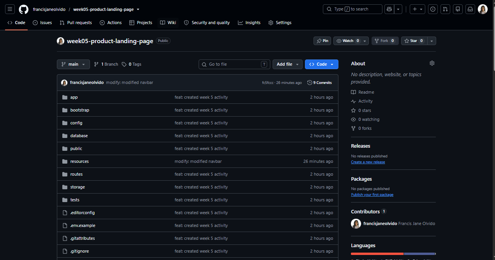

---

# Before and After Comparison

## Before

The first version of the SmokeHouse landing page focused mainly on creating the basic layout and implementing the required sections.

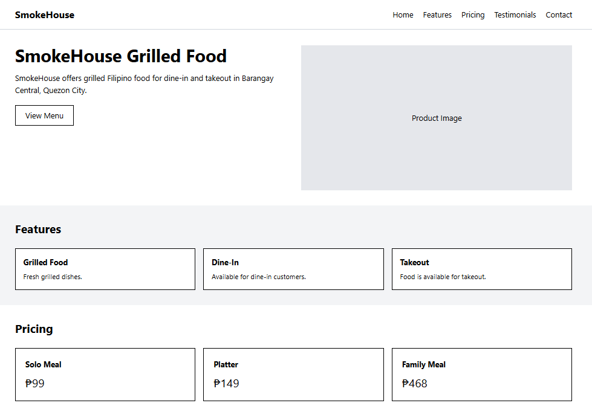

## After

The final version improved:

- Visual hierarchy
- Typography
- Spacing
- Responsive layouts
- Navigation
- Card consistency
- Product presentation
- SmokeHouse branding
- Mobile usability
- Reusable Blade Components

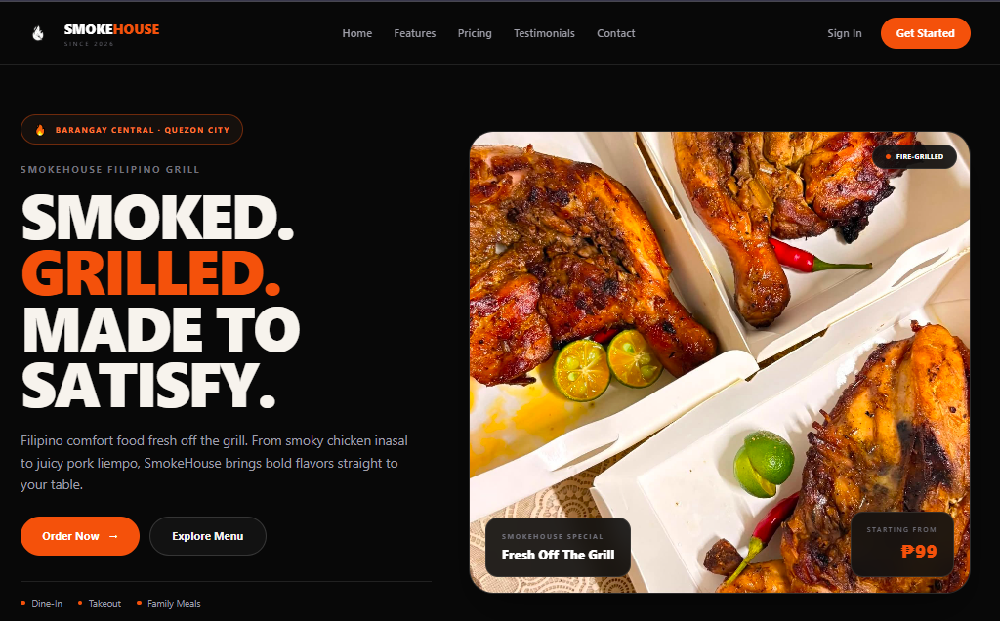

---

# Problems Encountered and Solutions

## Tailwind CSS Was Not Applying Correctly

### Problem

During development, the page initially displayed mostly unstyled HTML even though Tailwind classes were already added to the Blade templates.

### Solution

The Tailwind source paths were added to `resources/css/app.css`.

```css
@source '../**/*.blade.php';
@source '../**/*.js';
```

After updating the file, the development server was restarted and Tailwind correctly detected the classes used in the project.

---

## Broken Hero Image

### Problem

The hero image did not display because the filename referenced by the Blade component did not match the image stored inside the `public/images` folder.

### Solution

The image was stored as:

```text
public/images/hero-smokehouse.jpg
```

It was then loaded using Laravel's `asset()` helper:

```blade
{{ asset('images/hero-smokehouse.jpg') }}
```

---

## Blade Components After Folder Reorganization

### Problem

After organizing components into `features`, `pricing`, and `testimonials` subfolders, some Blade components were no longer found.

### Solution

Laravel Blade dot notation was used.

Examples:

```blade
<x-features.features />
<x-features.feature-card />

<x-pricing.pricing />
<x-pricing.pricing-card />

<x-testimonials.testimonials />
<x-testimonials.testimonial-card />
```

---

## Improving the Visual Design

### Problem

The first design contained brighter icons and visual elements that did not completely match the SmokeHouse branding.

### Solution

The design was simplified by using:

- Black and charcoal backgrounds
- White text
- One orange accent color
- Simple single-color icons
- Real food photography
- Minimal hover effects
- Consistent card styling

---

# Technologies Used

- Laravel
- Blade Templates
- Blade Components
- Tailwind CSS
- HTML
- JavaScript
- Vite
- Git
- GitHub

---

# Reflection

This project helped me understand how Laravel Blade Components and Tailwind CSS can work together to create a responsive and maintainable frontend interface.

Using reusable Blade Components helped reduce repeated code and made it easier to keep the design consistent throughout the landing page. I also learned how important responsive design is because elements such as navigation, cards, images, buttons, and layouts need to adjust properly depending on the user's device.

Developing the SmokeHouse landing page showed me how an existing local business can be transformed into a cleaner and more professional online experience through thoughtful UI and UX design.

---

# GitHub Repository

Repository:

```text
https://github.com/francisjaneolvido/week05-product-landing-page.git
```

---

# Author

**Name:** Francis Jane Olvido  
**Course:** ITST 302 – Client-Server Technologies  
**Week:** Week 5  
**Project:** Mini Project 04 – Responsive Product Landing Page  
**Project Type:** Individual  

---

# Disclaimer

This website was created for academic purposes as part of the ITST 302 Week 5 laboratory activity.

The testimonial names and reviews currently displayed in the project are sample hardcoded content created for demonstration purposes and should not be interpreted as verified SmokeHouse customer reviews.